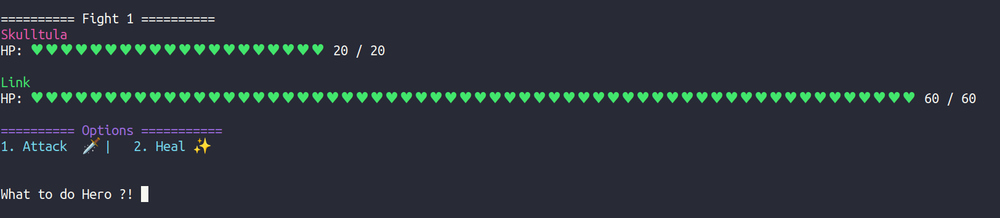
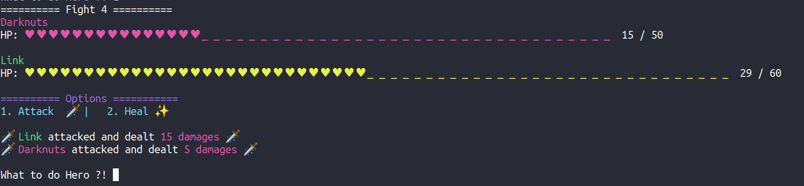

# **Hyrule castle**

I coded this project as part of my training, to discover object-oriented programming (OOP).

# Gameplay

Welcome Hero,

To play this game you'll need few commands. Your goal is to defeat the enemies and the boss to save the kingdom of Hyrule.
Here are a few commands to use youre character's powers:

The key 1️⃣ is your attack command, using the power of the hero and your sword you'll damage the enemy up to your strength capacity.

The key 2️⃣ is your heal command, using the grace of the princess Zelda, you'll be able to heal yourself by half your maximum life points.

The boss is hidden in the 10th floor of a tower, you'll have to slay the enemies on your path and be carefull not to die, some enemies are strong and you're the last chance to save the kingdom.

# Screenshots





# Launch Hyrule Castle

```
ts-node hyrule_castle.ts
```
